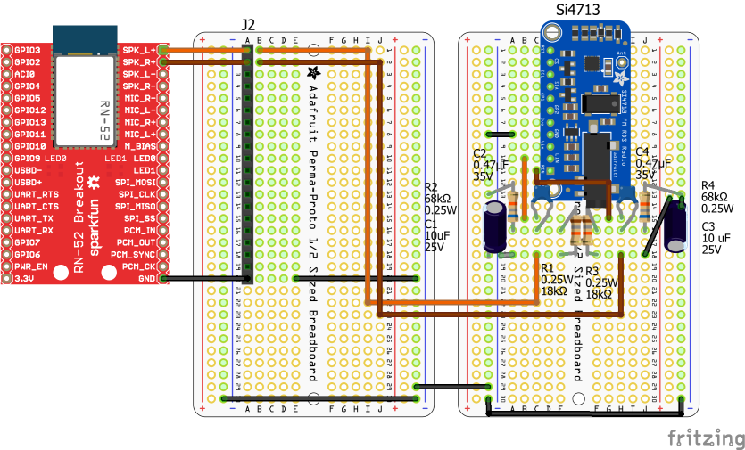
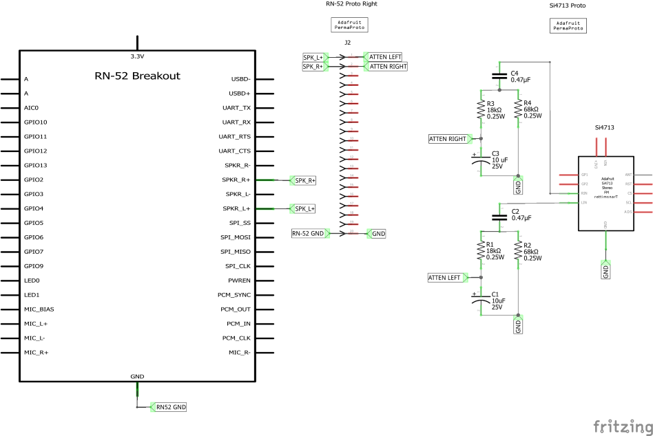

# BTFM

## History

This project started when I had a truck without bluetooth capability, and the cassette adapters were wearing out, then becoming hard to find.  
After version 1.0.0 was successfully field tested, I promptly went and bought a new truck because the old truck had fatal engine issues.  
Of course, the new truck had bluetooth and usb ports, so the project went on hold until I bought a new RV.  
Turned out the stereo in the trailer had a limitation of 3 Gb on its usb port, so I resumed the project.  

## Versioning

BTFM uses semantic versioning (Major.Minor.Patch)  
Major: Breaking changes Eg. new hardware incompatible with existing codebase  
Minor: Non-breaking changes Eg. new code functionality, new compatible hardware  
Patch: All other non-breaking changes Eg. Bug fixes, comments  

### Current Version

1.5.1 Cleaned up code comments and finalized debugging options. This version is production deployable.

### Previous Versions

1.5.0 Added 4 channel logic level shifter board.  
1.4.2 Streamlined debugging options.  
1.4.1 Updated RN-52 DFU firmware.  
1.4.0 Added mini USB connection.  
1.3.0 Added inductor for tx antenna and dc coupling capacitors for audio quality.  
1.2.1 Removed Serial debugging statements.  
1.2.0 Added jtag and swd connections for uploading/debugging.  
1.1.1 Tested basic UI capability of capacitive touch screen.  
1.1.0 Added mega shield and capacitive touch shield.  
1.0.0 Basic prototype, mega2560, RN-52, RN-52 speaker output attenuator, Si4713 on breadboard to prove concept is viable.

## Bill of Materials

| Item      | Count     | Link      | Part Number |
| --------- | --------- | --------- | ----------- |
| Arduino Mega2560 R3 Board | 1 | [Sparkfun Arduino Mega 2560 R3](https://www.sparkfun.com/products/11061) | DEV-11061 |
| Atmel-ICE Debugger     | 1 | [Digikey Atmel-ICE Basic](https://www.digikey.ca/en/products/detail/microchip-technology/ATATMEL-ICE-BASIC/4753381?utm_adgroup=&utm_source=google&utm_medium=cpc&utm_campaign=PMax%20Product_Low%20ROAS%20Categories&utm_term=&productid=4753381&utm_content=&utm_id=go_cmp-20291741422_adg-_ad-__dev-c_ext-_prd-4753381_sig-EAIaIQobChMIvM6727jdgwMV7zutBh3bswzIEAQYASABEgI7UPD_BwE&gad_source=1&gclid=EAIaIQobChMIvM6727jdgwMV7zutBh3bswzIEAQYASABEgI7UPD_BwE) | ATATMEL-ICE-BASIC-ND |
|_________________________________________________________________________|_______|______________________________________________|__________________________|
| 2.8" TFT Capacitive Touch with microSd | 1 | [Adafruit 2.8" TFT Touch Shield](https://www.adafruit.com/product/1947) | 1947 |
| Si4713 Stereo FM Transmitter with RDS/RDBS Breakout | 1 | [Adafruit Stereo FM Transmitter](https://www.adafruit.com/product/1958) | 1958 |
| RN-52 Audio Bluetooth Breakout | 1 | [Sparkfun Audio Bluetooth Breakout](https://www.sparkfun.com/products/retired/12849) | WRL-12849 |
| Sparkfun FTDI Basic Breakout - 3.3V | 1 | [Sparkfun FTDI Basic Breakout](https://www.sparkfun.com/products/9873?_gl=1*173untz*_ga*MTc1Mjg5MTM4NC4xNzAxMTA1MDY1*_ga_T369JS7J9N*MTcwNTI3MzMxNC4xNC4xLjE3MDUyNzQyMzcuNjAuMC4w&_ga=2.171073504.1571879566.1705185864-1752891384.1701105065) | DEV-09873 |
| USB Mini-B Breakout Board | 1 | [Adafruit USB Mini-B Breakout Board](https://www.adafruit.com/product/1764) | 1764 |
| USB Mini-B Cable | 1 | [Sparkfun USB Mini-B Cable](https://www.sparkfun.com/products/11301?_gl=1*6zq9iw*_ga*MTc1Mjg5MTM4NC4xNzAxMTA1MDY1*_ga_T369JS7J9N*MTcwNTI3MzMxNC4xNC4xLjE3MDUyNzM4MTQuNjAuMC4w&_ga=2.170488672.1571879566.1705185864-1752891384.1701105065) | CAB-11301 |
|_________________________________________________________________________|_______|______________________________________________|__________________________|
| Adafruit Perma-Proto 1/2 Sized Breadboard | 3 | [Adafruit Perma-Proto 1/2 Sized Breadboard](https://www.adafruit.com/product/571) | 571 |
| Adafruit Perma-Proto 1/4 Sized Breadboard | 1 | [Adafruit Perma-Proto 1/4 Sized Breadboard](https://www.adafruit.com/product/589) | 589 |
|_________________________________________________________________________|_______|______________________________________________|__________________________|
| Mini Pushbutton Switch | 8 | [Sparkfun Mini Pushbutton](https://www.sparkfun.com/products/97?_gl=1*36uoho*_ga*MTc1Mjg5MTM4NC4xNzAxMTA1MDY1*_ga_T369JS7J9N*MTcwNTE4NTg2My4xMS4wLjE3MDUxODU4NjMuNjAuMC4w&_ga=2.58816493.1571879566.1705185864-1752891384.1701105065) | COM-0097 |
| Mini Power Switch - SPDT | 2 | [Sparkfun Mini Power Switch](https://www.sparkfun.com/products/102?_gl=1*1s0kwn0*_ga*MTc1Mjg5MTM4NC4xNzAxMTA1MDY1*_ga_T369JS7J9N*MTcwNTE4NTg2My4xMS4xLjE3MDUxODY2OTMuNjAuMC4w&_ga=2.103970880.1571879566.1705185864-1752891384.1701105065) | COM-00102 |
| 10 uF Polarized Capacitor | 2 | [Sparkfun Electrolytic Decoupling Capacitors](https://www.sparkfun.com/products/523) | COM-00523 |
| 0.47 uF Ceramic Capacitor | 2 | [Digikey Ceramic Capacitor](https://www.digikey.ca/en/products/detail/kemet/C315C474K5R5TA/3726125) | 399-9741-ND |
| 68 kOhm resistor | 2 | [Sparkfun Resistor Kit](https://www.sparkfun.com/products/10969) | COM-10969 |
| 18 kOhm resistor | 2 | [Sparkfun Resistor Kit](https://www.sparkfun.com/products/10969) |  COM-10969 |
| 120 nH inductor | 1 | [Digikey Molded Axial Inductor](https://www.digikey.ca/en/products/detail/bourns-inc/9230-96-RC/3779375) | 118-9230-96-RC-ND |

## Hardware Tools
[Atmel-ICE Basic](https://www.microchip.com/en-us/development-tool/atatmel-ice)  is a development tool for debugging and programming ARM® Cortex®-M based SAM and AVR microcontrollers with on-chip debug capability.  
[Arduino Mega 2560 Rev3](https://docs.arduino.cc/hardware/mega-2560/) is a microcontroller board based on the ATmega2560.  
It has: 
1. 54 digital input/output pins (of which 15 can be used as PWM outputs)
2. 16 analog inputs
3. 4 UARTs (hardware serial ports)
4. a 16 MHz crystal oscillator
5. a USB connection
6. a power jack
7. an ICSP header
8. and a reset button.  

## Software Tools
### AVR Programming
[AVRDUDE](https://github.com/avrdudes/avrdude/) is a program for downloading and uploading the on-chip memories of Microchip’s AVR microcontrollers.  
[AVRDUDESS](https://github.com/ZakKemble/AVRDUDESS?tab=readme-ov-file) is GUI for AVRDUDE. 

Using AVRDUDE/AVRDUDESS will require using a hardware programmer/debugger like Atmel-ICE.  
You will also need to know what fuse programming is and how to set the fuses for the Mega 2560.  
[ATmega2560 Datasheet](https://ww1.microchip.com/downloads/aemDocuments/documents/OTH/ProductDocuments/DataSheets/ATmega640-1280-1281-2560-2561-Datasheet-DS40002211A.pdf)  

### CAD
[Fritzing](https://fritzing.org/) is be no means the best CAD program, but it is free ( and still cheap even when you buy the licensed version), easy enough to learn, and reasonably well supported.  
[Eagle](http://eagle.autodesk.com/) and [KiCad](https://www.kicad.org/) are far more powerful, but steeper learning curve options.

### Drivers
[Windows FTDI Executable](https://cdn.sparkfun.com/assets/learn_tutorials/7/4/CDM21228_Setup.exe)

### IDES
[Arduino](https://docs.arduino.cc/software/ide/)  
Using the Arduino IDE is somewhat optional.  
It easier to install libraries and boards via the Arduino IDE than Microchip Studio with Visual Micro extension for the simple fact of the extension installation and setup overhead.  
That said, once you do have the extension installed, there is no need to uise the Arduino IDE again.  

[Microchip Studio Download](https://www.microchip.com/en-us/tools-resources/develop/microchip-studio)  
[Microchip Studio User Guide](https://ww1.microchip.com/downloads/aemDocuments/documents/MCU08/ProductDocuments/UserGuides/Microchip-Studio-UserGuide-DS50002718.pdf)  
Microchip Studio is major pain in the ass. This will be the last project I use it for.  
The documentation is poor - tells you where & how to find things (*mostly*) but not **why** do do things.  

### IDE Extension
[Visual Micro](https://www.visualmicro.com/)  
[Visual Micro Table of Contents](https://www.visualmicro.com/page/User-Guide.aspx?doc=index)  

Visual Micro is an extension (plugin/add-on) for Microsoft Microchip Studio 7 that allows any Arduino project to be developed, compiled, and then uploaded to any Arduino board, while taking benefit of the powerful features of Microchip Studio.  
Visual Micro works alongside, and is compatible with, the Arduino development environment, using the same libraries, source code, and development tools.  
The difference lies in Visual Micro's user interface which provides an advanced and professional development environment, and allows for more advanced development than the existing Arduino IDE.

#### VisualMicro Flaw
Visual Micro comes with it's own set of issues.  
One of the most frustrating is the compilation flags are hard coded in the extension installed platform.txt file,  
( which contains definitions for the CPU architecture used - compiler, build process parameters, tools used for upload, etc.).  

This is fine for beginning users coming the Arduino IDE - the whole point is to make development easier.  
Why Visual Micro elected to use the hard coded approach baffles me - doing so means that any compiler flags you want to set in Microchip **are overridden**.  

So if you want to compile a non-optimized max debug level hex file, you *can't*.  
This creates a very strong argument for manual compilation and using the Arduino CLI !!  

The platform.txt file is located at: C:\Program Files (x86)\Atmel\Studio\7.0\Extensions\<extension id>\Micro Platforms\mpide\hardware\arduino\  
The default flags are -g -Os (minimal debgug level and optimize for size).  

For example, to compile a max debug level no optimization build, comment out original line:  
```
compiler.c.flags=-c -g -Os -w -ffunction-sections -fdata-sections -MMD
```
and add:  
```
compiler.c.flags=-c -g3 -O0 -w -ffunction-sections -fdata-sections -MMD
```  
do the same for the cpp compile flag:   
```  
compiler.cpp.flags=-c -g -Os -w -fno-exceptions -ffunction-sections -fdata-sections -MMD
```  
and add:  
```   
compiler.cpp.flags=-c -g3 -O0 -w -fno-exceptions -ffunction-sections -fdata-sections -MMD
```  
Change these as you see fit when you are ready for a production build.  


### Terminal Emulator
[TeraTerm Project](https://github.com/TeraTermProject/teraterm/releases)  
[Tera Term Help Index](https://teratermproject.github.io/manual/5/en/)  
TeraTerm is the terminal emulator for Microsoft Windows, that supports serial port, telnet and SSH connections. 

## IMPORTANT ARDUINO IDE SETUP
The Arduino AVR Board Library has a known bug in versions greater than 1.82:  
 
[Downgrade Arduino AVR Boards to 1.82](https://github.com/LubomirJagos/LabVIEW-Universal-Transcriptor/issues/3)

To workaround, use Arduino IDE tools>Board>Board Manager to select Arduino AVR Boards.  
Select version 1.8.2 from drop down list.  
**DO NOT UPDATE THIS BOARD WHEN YOU OPEN THE IDE AND GET UPDATE INFO DIALOG BOX**

## Required Arduino Libraries
### Pre-installed Arduino hardware libraries  
[SPI](https://www.arduino.cc/reference/en/language/functions/communication/spi/)  
[Wire](https://www.arduino.cc/reference/en/language/functions/communication/wire/)  
These libraries come installed with Arduino IDE, so all you have to do is reference them in code.  
```c++
#include <SPI.h>
#include <Wire.h>
```

### Arduino libraries to install
[ArduinoSTL](https://www.arduino.cc/reference/en/libraries/arduinostl/)  
v1.1.0  
1. algorithm
2. vector  
```c++
#include <ArduinoSTL.h>
#include <algorithm>
#include <vector>
```

### Third party hardware libraries to install
[Adafruit_FT6206](https://www.arduino.cc/reference/en/libraries/adafruit-ft6206-library/)  
v1.03

[Adafruit_GFX](https://www.arduino.cc/reference/en/libraries/adafruit-gfx-library/)  
v1.5.7  

[Adafruit_ILI9341](https://www.arduino.cc/reference/en/libraries/adafruit-ili9341/)  
v1.5.1

[Adafruit Stereo FM Transmitter with RDS/RDBS Breakout - Si4713](https://www.arduino.cc/reference/en/libraries/adafruit-si4713-library/)  
v1.0.0  
```c++
#include <Adafruit_GFX.h>
#include <Adafruit_ILI9341.h>
#include <Adafruit_FT6206.h>
#include <Adafruit_Si4713.h>
```

## Hardware
### Project Fritzing
  

### Project Schematic
  

### Programming & Debugging
To hardware program & debug the Mega 2560 R3, 4 things are required:

1. Cut the reset-en pads  
***CUTTING THE reset-en pads REQUIRES USING HARDWARE PROGRAMMING***   
  

2. JTAG .5mm pitch 2x5 connection  
Adafruit SWD (2x5 1.27mm) Cable Breakout Board  
ID: 2743  
**NB this is an SWD breakout, not a JTAG breakout**  
*The pin outs are different and will have to be mapped!!!*  
Finding a  shield/breakout specifically for AVR JTAG is a real pain.  
Fortunately, the breakout from Adafruit has everything you need, you just have to do the pin mapping to the Mega 2560.  
As a bonus, you can both program and debug with this.  
  

3. AVR ISP Breadboard Adapter Mini Kit  
ID: 1465  
The ISP (or SPI, or ICSP - the all mean the same thing) connection is for *uploading only* to the Mega 2560  
You can upload via Microchip Studio or AVRDUDESS/AVRDUDE  
  

4. Atmel-ICE Basic  
Atmel-ICE allows programming (JTAG and SPI) and debugging of all AVR 8-bit microcontrollers with OCD support.  
[Atmel-ICE user guide](https://ww1.microchip.com/downloads/aemDocuments/documents/OTH/ProductDocuments/UserGuides/Atmel-ICE_UserGuide.pdf)  


#### Programming & Debugging Fritzing  
  

#### Programming & Debugging Schematic   
  

#### Programming & Debugging Procedures  
##### Programming
@TODO IPSUM LOREM  Microchip Studio 7 & Mega 2560 ISP upload details  

#### Debugging
@TODO IPSUM LOREM Microchip Studio 7 & Mega 2560 JTAG debugging details   

### Sparkfun  Audio Bluetooth Breakout - RN-52
#### Power
**First and foremost, the RN-52 is a 3.3V device.**  
It can handle an input voltage of about 3.0 - 3.6V.
Voltages above or below this range can result in the module not working properly or, worse, damaging the module.
Make sure you select a power supply that can provide the correct amount of voltage to the device.

Connect the GND pin to GND, and connect the 3.3V pin to the Vcc pin on the supply.
The PWR_EN pin can also be attached to a button to allow the user to power up the module when it is desired, even if power is already supplied.

This is useful in headset/hands-free applications where a battery is attached to the module but the module doesn't need to be on all the time.

#### GPIO4
Restore Factory Defaults with GPIO4

You should connect the GPIO4 pin to a switch, jumper, or resistor so it can be accessed.
You can use this pin to reset the module to its factory default settings, which is critical in situations where the module has been mis-configured.

To reset the module to the factory defaults, GPIO4 should be high on power-up and then *toggle low, high, low, high with a 1 second wait between the transitions.*

#### GPIO9
GPIO9 is used to tell the module to enter command mode.

If GPIO9 is HIGH or left floating, the module will remain in its default data mode, streaming audio or data.

In order to enter command mode, GPIO9 must be pulled LOW (to GND). Refer to fritzing diagram.

#### UART
You will need a way to communicate to the module and send commands. This will be accomplished with a 3.3V FTDI Basic.

##### Discovering your device
1. Connect FTDI to your computer with usb mini-b cable  
*If this is the first time you've plugged in a device of this nature into your computer, you may need to install the drivers.  
Follow this guide: [FTDI Driver Installation Guide](https://learn.sparkfun.com/tutorials/how-to-install-ftdi-drivers/all)*
2. Open Windows Device Manager
3. Once you've got Device Manger open, expand the Ports tab
4. You should see "USB Serial Port (COM 9)"
5. Right click on "USB Serial Port"
6. Select Properties
7. Select Driver tab
8. The driver provider should be FTDI

*If you do have multiple devices and are not sure which device is the one you just plugged in, unplug it, watch for whichever COM port disappears, and then plug it back in.  
The COM port should reappear, letting you know that's the device you're looking for.*

#### TeraTerm
Download: [TeraTerm Project](https://github.com/TeraTermProject/teraterm/releases)  
Once you have TeraTerm installed, open up it up.

#### Making a Connection
You should initially be presented with a "TeraTerm: New connection" pop-up within the program. Here, you can select which serial port you'd like to open up.

*Select the "Serial" radio button.*  
Then select your port from the drop-down menu.

*Select COM9: USB Serial Port*  
If this window doesn't open when you start TeraTerm, you can get here by going to File > New connection.

That'll open up the port. TeraTerm defaults to setting the baud rate at 9600 bps (8-N-1).  
*To adjust the serial settings, go up to Setup > Serial Port*.

| Setting | Value |
| ------- | ----- |
| Port | COM9 |
| Speed | 115200 |
| Data| 8 bit |
| Parity | none |
| Stop bits | 1 |
| Flow control | none |

Adjust to what you need to and hit "OK".

#### Configure the RN-52 Module
Download and read the [Bluetooth Audio Module Command Reference User's Guide](https://cdn.sparkfun.com/assets/a/2/a/a/d/5217c61f757b7f55758b456f.pdf?_gl=1*122wpwx*_ga*MTc1Mjg5MTM4NC4xNzAxMTA1MDY1*_ga_T369JS7J9N*MTcwNTE4NTg2My4xMS4xLjE3MDUxODc4MTUuNjAuMC4w)

Now that you can actually power up the RN-52 and send it into command mode, let's talk about changing the settings, and thus the behavior, of the Bluetooth module.

1. Make sure the CMD Mode switch is in the OFF position (GPIO9 NOT shorted to GND - refer to fritzing diagram).
2. Turn on your RN-52, and hold down the power reset button for approx 1 second.
3. The two status LEDs on the RN-52 should both stay solid for about 1 second and then begin flashing alternately.
4. Your device is now ready to make a connection. Rather than connect over Bluetooth, the connection will be made over the serial UART.
5. Open a TeraTerm terminal window on the port (COM 9) your RN-52 has been assigned (115200 Baud, 8,N,1).
6. With the terminal open and connected to the RN-52, flip the CMD Mode switch to the ON position (GPIO9 shorted to GND). You should now see CMD appear in your terminal.  
7. Turn on echo by typing + and hitting return.  
8. Enable AVRCP. By default, the RN-52 does not have the AVRCP enabled. This is part of the extended features. When you type D to see the basic settings, you'll notice a line that says ExtFeatures=XX, where XX is some hex value.  
9. Notice that bit 0 is the bit we need to enable to activate the AVRCP button functionality. Send the command S%,07(/r) to enable this bit while leaving the other two bits enabled.  
10. Then follow it up with a reboot -- R,1(/r), wait until you see reboot, then flip the CMD Mode switch back to Off.  
Hold down the power reset button for approx 1 second. You should now have AVRCP enabled. Flip the CMD Mode switch back to on (and turn echo on as well).  
11. Type D to double check the settings.  
12. To exit command mode, simply flip the switch back to the OFF position. You will see END appear in the window.  
13. Close TeraTerm.

#### RN-52 Status LED Functions
| Green LED | Red LED | Description |
| --------- | ------- | ----------- |
| Flashing | Flashing | The module is discoverable |
| Off | Flashing | The module is connected |
| Flashing | Off | The module is connectable |

#### Connect and Play
1. The green led and red led should be flashing alternately.
2. Open the Bluetooth tab on your Android device
3. Wait for scan to finish.
4. You should see an available device that matches the BTName from the "D" command  
5. Select it for pairing.
6. If pairing was successful, the green led will stop flashing and the red led will start flashing.
7. You can now start streaming music.

#### Firmware Upgrade
@TODO upgrade instructions ipsum lorem  

##### Firmware Upgrade Fritzing
  

##### Firmware Upgrade Schematic


### Adafruit Stereo FM Transmitter with RDS/RDBS Breakout - Si4713
@TODO IPSUM LOREM add Si4713 info  
@TODO Add datasheet links  

#### Speaker Level to Line Level
The RN-52 audio output circuitry consists of a balanced differential speaker output preceded by a gain stage and a class AB amplifier.  
The output voltage full scale swing (differential) is 750mV.  
The speaker output is capable of driving a speaker with an impedance of at least 8 ohms directly.  
The overall gain of the speaker output is approximately 0 db to -21 dB in 1.5 dB steps.  

| Parameter | Conditions |   | Min | Typ | Max | Unit |
| --------- | ---------- | - | --- | --- | --- | ---- |
| Resolution | — || — | — | 16 | Bits |
| Output Sample Rate, Fsample | — || 8 | — | 48 | kHz |
| Signal to Noise Ratio, SNR | fin = 1 kHz   B/W = 20 Hz→20 kHz  A-Weighted  THD+N < 0.01%  0dBFS signal  Load = 100 kΩ | Fsample | — | 95 | — | dB |
||| 8 kHz | — | 95 | — | dB |
||| 16 kHz | — | 95 | — | dB |
||| 32 kHz | — | 95 | — | dB |
||| 44.1 kHz | — | 95 | — | dB |
||| 48 kHz | — | 95 | — | dB |
| Analog Gain | Analog Gain Resolution = 3 dB || 0 | — | -21 | dB |
| Output voltage full-scale swing (differential) ||| — | 750 | — | mV rms |
| Allowed Load | Resistive || 16(8) | — | O.C. | Ω |
|| Capacitive || — | — | 500 | pF |
| THD + N 100 kΩ load ||| — | — | 0.01 | % |
| THD + N 16 kΩ load ||| — | — | 0.1 | % |
| SNR (Load = 16Ω, 0 dBFS input relative to digital silence) ||| — | 95 | — | db |

The Si4713 has LIN/RIN unbalanced line level analog inputs, which can be fed directly to the pins or via the 3.5 mm jack.  
The Si4713 can take a max of 636 mV on line level inputs (this is default setting).

The RN-52 output speaker level needs to be attenuated from 750 mV to less than or equal to 636 mV.

##### Speaker to Line Level Attenuator Fritzing
  

##### Speaker to Line Level Attenuator Schematic
  
Si4713 and RN-52 power connections omitted for brevity  

#### TX Antenna
The antenna specs in data sheets are conflicting and confusing.
Currently using a 22 AWG wire in 18 x 13 cm single wire square loop configuration
If Equation 30 of AN710 datasheet is correct application for my antenna, I have an inductance of 666 nH.

### 2.8" TFT Touch Shield for Arduino with Capacitive Touch and microSd
@TODO IPSUM LOREM TFT touch shield information  