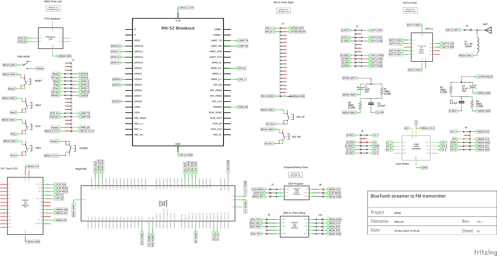
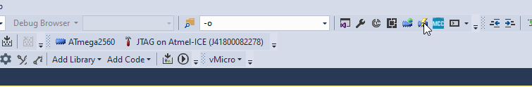
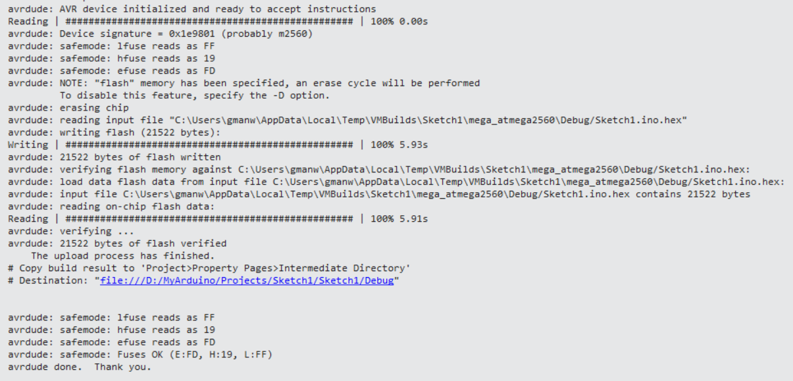
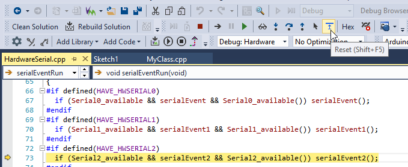
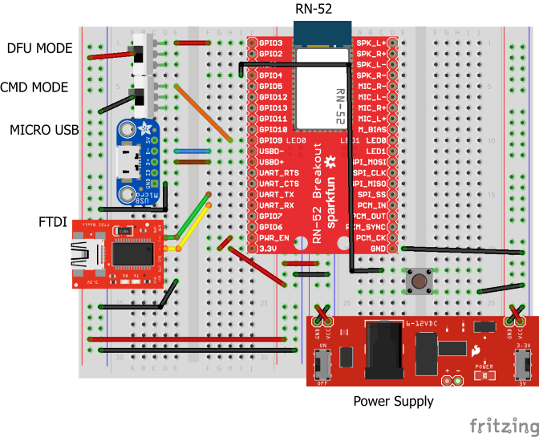
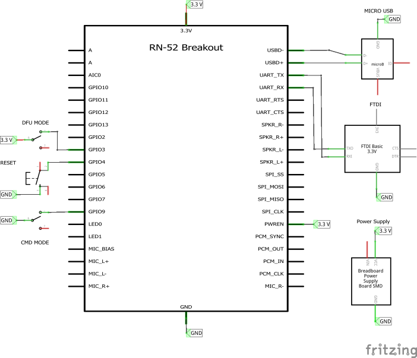
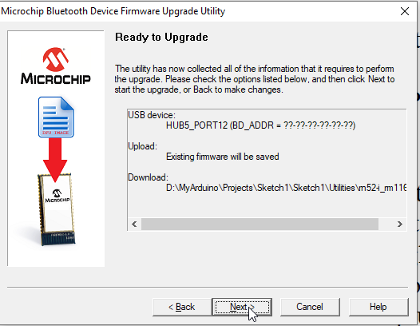

# History
This project started when I had a truck without bluetooth capability, and the cassette adapters were wearing out, then becoming hard to find.  
I did purchase an Scosche Bluetooth Vehicle FM transmitter, so I knew the concept was feasible.  
The Scosche unit itself was crap - the display failed after 6 months use. So I decided to build my own.  

After version 1.0.0 was successfully field tested, I promptly went and bought a new truck because the old truck had fatal engine issues.  
Of course, the new truck had bluetooth and usb ports, so the project went on hold until I bought a new RV.  
Turned out the stereo in the trailer had a limitation of 3 Gb on its usb port, and I have far more in music files than that, so I resumed the project.  

# Concept
The concept is straight forward - bluetooth streaming music from an android device to a fm receiver.  
I can stream music via the [ServiiGo app](https://serviio.org/apps) on my phone from my [Serviio Media Streamer Server](https://www.serviio.org/),  
or play directly from stored media on my phone when I don't have cell service.  

## Design
Initial research came up with the 2 critical components:  
- [Sparkfun Audio Bluetooth Breakout](https://www.sparkfun.com/products/retired/12849)  
- [Adafruit Stereo FM Transmitter](https://www.adafruit.com/product/1958)  

Both of these breakouts were arduino compatible.  
I had several Uno's and Mega 2560's on hand, and used the Mega 2560 because it has more functionality.  

The Mega 2560 supplies the microcontroller and power.  
Perma-proto breadboards supply the substrate for hardwiring discrete components, breakouts & shields.  
The RN-52 is the bluetooth sink from the android streaming source and audio signal source for the fm transmitter.  
The Si4713 is the audio signal sink and transmits the audio in FM band.  
The 2.8" LCD is used for graphic user interface input and output.  

# Versioning
BTFM uses semantic versioning (Major.Minor.Patch)  
Major: Breaking changes Eg. new hardware incompatible with existing codebase  
Minor: Non-breaking changes Eg. new code functionality, new compatible hardware  
Patch: All other non-breaking changes Eg. Bug fixes, comments  

## Current Version
1.6.0 Media Information  
- Display current media information on lcd touch screen 
- Display next media information
- Display previous media information 

## Planned Versions
1.6.1 Full UI control
- lcd touch screen UI control of play/pause/for/rev/volume
- re-scan for available broadcast frequencies  
- change broadcast frequency
 
1.7.0 Miniaturization  
- custom pcb design and manufacture  

## Previous Versions
1.5.1 First production deployable version.
1.5.0 Added 4 channel logic level shifter board.  
1.4.0 Added mini USB connection and updated RN-52 DFU firmware.  
1.3.0 Added inductor for tx antenna and dc coupling capacitors for audio quality.  
1.2.1 Removed Serial debugging statements and streamlined debugging options.  
1.2.0 Added jtag and swd connections for uploading/debugging.  
1.1.1 Tested basic UI capability of capacitive touch screen.  
1.1.0 Added mega shield and capacitive touch shield.  
1.0.0 Basic prototype, mega2560, RN-52, RN-52 speaker output attenuator, Si4713 on breadboard to prove concept is viable.  

# Bill of Materials
| Item      | Count     | Link      | Part Number |
| --------- | --------- | --------- | ----------- |
| Atmel-ICE Debugger     | 1 | [Digikey Atmel-ICE Basic](https://www.digikey.ca/en/products/detail/microchip-technology/ATATMEL-ICE-BASIC/4753381?utm_adgroup=&utm_source=google&utm_medium=cpc&utm_campaign=PMax%20Product_Low%20ROAS%20Categories&utm_term=&productid=4753381&utm_content=&utm_id=go_cmp-20291741422_adg-_ad-__dev-c_ext-_prd-4753381_sig-EAIaIQobChMIvM6727jdgwMV7zutBh3bswzIEAQYASABEgI7UPD_BwE&gad_source=1&gclid=EAIaIQobChMIvM6727jdgwMV7zutBh3bswzIEAQYASABEgI7UPD_BwE) | ATATMEL-ICE-BASIC-ND |
| Software Defined Radio Receiver | 1 | [Adafruit SDR Receiver USB Stick](https://www.adafruit.com/product/1497) | 1497 |
| Wall Wart Power Supply | 1 | [Digikey AC/DC Wall Mount Adapter](https://www.digikey.ca/en/products/detail/cui-inc/SWI24-12-N-P5R/5415102) | 102-3631-ND |
| USB Mini-B Cable | 1 | [Sparkfun USB Mini-B Cable](https://www.sparkfun.com/products/11301?_gl=1*6zq9iw*_ga*MTc1Mjg5MTM4NC4xNzAxMTA1MDY1*_ga_T369JS7J9N*MTcwNTI3MzMxNC4xNC4xLjE3MDUyNzM4MTQuNjAuMC4w&_ga=2.170488672.1571879566.1705185864-1752891384.1701105065) | CAB-11301 |
|_________________________________________________________________________|_______|______________________________________________|__________________________|
| Arduino Mega2560 R3 Board | 1 | [Sparkfun Arduino Mega 2560 R3](https://www.sparkfun.com/products/11061) | DEV-11061 |
| 2.8" TFT Capacitive Touch with microSd | 1 | [Adafruit 2.8" TFT Touch Shield](https://www.adafruit.com/product/1947) | 1947 |
| Stereo FM Transmitter with RDS/RDBS Breakout | 1 | [Adafruit Stereo FM Transmitter](https://www.adafruit.com/product/1958) | 1958 |
| Audio Bluetooth Breakout | 1 | [Sparkfun Audio Bluetooth Breakout](https://www.sparkfun.com/products/retired/12849) | WRL-12849 |
| FTDI Basic Breakout - 3.3V | 1 | [Sparkfun FTDI Basic Breakout](https://www.sparkfun.com/products/9873?_gl=1*173untz*_ga*MTc1Mjg5MTM4NC4xNzAxMTA1MDY1*_ga_T369JS7J9N*MTcwNTI3MzMxNC4xNC4xLjE3MDUyNzQyMzcuNjAuMC4w&_ga=2.171073504.1571879566.1705185864-1752891384.1701105065) | DEV-09873 |
| Bi-Directional Logic Level Converter | 1 | [Sparkfun Logic Level Converter](https://www.sparkfun.com/products/12009) | BOB-12009 |
| Breadboard Power Supply | 1 | [Sparkfun Breadboard Power Supply](https://www.sparkfun.com/products/13032) | PRT-13023 |
| SWD Breakout Board | 1 | [Adafruit SWD Cable Breakout Board](https://www.adafruit.com/product/2743) | 2743 |
| AVR ISP Adapter | 1 | [Adafruit AVR 6 Pin ISP Adapter](https://www.adafruit.com/product/1465) | 1465 |
| USB Mini-B Breakout Board | 1 | [Adafruit USB Mini-B Breakout Board](https://www.adafruit.com/product/1764) | 1764 |
|_________________________________________________________________________|_______|______________________________________________|__________________________|
| Perma-Proto 1/2 Sized Breadboard | 3 | [Adafruit Perma-Proto 1/2 Sized Breadboard](https://www.adafruit.com/product/571) | 571 |
| Perma-Proto 1/4 Sized Breadboard | 1 | [Adafruit Perma-Proto 1/4 Sized Breadboard](https://www.adafruit.com/product/589) | 589 |
| Arduino Mega Proto Shield | 1 | [Arduino Mega Proto Shield Rev3](https://store.arduino.cc/products/arduino-mega-proto-shield-rev3-pcb?srsltid=AfmBOoqN59Zec0_bKIih6BLsr4rHgGG_DDj2sNOlPADLfpzvrRtf7udL) | A000080 |
|_________________________________________________________________________|_______|______________________________________________|__________________________|
| Female Headers | 10 | [Sparkfun Female Headers](https://www.sparkfun.com/products/115) | PRT-00115 |
| Stackable Header | 2 | [Sparkfun 3 Pin Stackable Header](https://www.sparkfun.com/products/13875) | PRT-13875 |
| Arduino Stackable Header | 1 | [Sparkfun Arduino Uno Stackable Header Kit](https://www.sparkfun.com/products/11417) | PRT-11417 |
| Breakaway Headers - Straight | 1 | [Sparkfun Headers - Straight](https://www.sparkfun.com/products/10158) | PRT-10158 |
| Breakaway Headers - Right Angle | 1 | [Sparkfun Headers - Right Angle](https://www.sparkfun.com/products/553) | PRT-00553 |
|_________________________________________________________________________|_______|______________________________________________|__________________________|
| Mini Pushbutton Switch | 8 | [Sparkfun Mini Pushbutton](https://www.sparkfun.com/products/97?_gl=1*36uoho*_ga*MTc1Mjg5MTM4NC4xNzAxMTA1MDY1*_ga_T369JS7J9N*MTcwNTE4NTg2My4xMS4wLjE3MDUxODU4NjMuNjAuMC4w&_ga=2.58816493.1571879566.1705185864-1752891384.1701105065) | COM-0097 |
| Mini Power Switch - SPDT | 3 | [Sparkfun Mini Power Switch](https://www.sparkfun.com/products/102?_gl=1*1s0kwn0*_ga*MTc1Mjg5MTM4NC4xNzAxMTA1MDY1*_ga_T369JS7J9N*MTcwNTE4NTg2My4xMS4xLjE3MDUxODY2OTMuNjAuMC4w&_ga=2.103970880.1571879566.1705185864-1752891384.1701105065) | COM-00102 |
| 10 uF Polarized Capacitor | 2 | [Sparkfun Electrolytic Decoupling Capacitors](https://www.sparkfun.com/products/523) | COM-00523 |
| 0.47 uF Ceramic Capacitor | 2 | [Digikey Ceramic Capacitor](https://www.digikey.ca/en/products/detail/kemet/C315C474K5R5TA/3726125) | 399-9741-ND |
| 68 kOhm resistor | 2 | [Sparkfun Resistor Kit](https://www.sparkfun.com/products/10969) | COM-10969 |
| 18 kOhm resistor | 2 | [Sparkfun Resistor Kit](https://www.sparkfun.com/products/10969) |  COM-10969 |
| 120 nH inductor | 1 | [Digikey Molded Axial Inductor](https://www.digikey.ca/en/products/detail/bourns-inc/9230-96-RC/3779375) | 118-9230-96-RC-ND |

# Hardware Tools
[Atmel-ICE Basic](https://www.microchip.com/en-us/development-tool/atatmel-ice)  is a development tool for debugging and programming ARM® Cortex®-M based SAM and AVR microcontrollers with on-chip debug capability.  
[Adafruit SDR Receiver USB Stick](https://www.adafruit.com/product/1497) is a powerful, configurable receiver, it can tune into signals from 48.25 - 863.25MHz.  

# Software Tools  
## AVR Programming (Optional)
[AVRDUDE](https://github.com/avrdudes/avrdude/) is a program for downloading and uploading the on-chip memories of Microchip’s AVR microcontrollers.  
[AVRDUDESS](https://github.com/ZakKemble/AVRDUDESS?tab=readme-ov-file) is GUI for AVRDUDE. 

Using AVRDUDE/AVRDUDESS will require using a hardware programmer/debugger like Atmel-ICE.   
You will also need to know what fuse programming is and how to set the fuses for the Mega 2560.   
[ATmega2560 Datasheet](Docs/Mega2560/ATmega2560_datasheet.pdf)  

## CAD
[Fritzing](https://fritzing.org/) is be no means the best CAD program, but it is free ( and still cheap even when you buy the licensed version), easy enough to learn, and reasonably well supported.  
[Eagle](http://eagle.autodesk.com/) and [KiCad](https://www.kicad.org/) are far more powerful, but steeper learning curve options.

## Drivers
[Windows FTDI Executable](https://cdn.sparkfun.com/assets/learn_tutorials/7/4/CDM21228_Setup.exe)  Virtual COM Port (VCP) driver for FTDI USB to UART interface.  
[Zadig 2.2](https://cdn-learn.adafruit.com/assets/assets/000/067/708/original/zadig_2.2.zip?1544933420) Windows application for installing generic USB drivers.

## IDES
[Arduino](https://docs.arduino.cc/software/ide/)  
Using the Arduino IDE is somewhat optional.   
It easier to install libraries and boards via the Arduino IDE than Microchip Studio with Visual Micro extension for the simple fact of the extension installation and setup overhead.  
That said, once you do have the extension installed, there is no need to use the Arduino IDE again.  

[Microchip Studio Download](https://www.microchip.com/en-us/tools-resources/develop/microchip-studio)  
[Setting Started with Microchip Studio](Docs/MicrochipStudio/Getting-Started-with-Microchip-Studio-DS50002712B.pdf)  
[Microchip Studio User Guide](Docs/MicrochipStudio/Microchip-Studio-UserGuide-DS50002718.pdf)  
Microchip Studio is Microchip's (formerly Atmel) IDE for AVR/ARM applications, based on Visual Studio.  

Microchip Studio is major pain in the ass. This will be the last project I use it for.  
The documentation is poor - tells you where & how to find things (*mostly*) but not **why** do do things.  
As for using the Atmel-ICE in conjunction with Microchip Studio and a Mega 2560 - well, that was an exercise in frustration.  
I will be investigating setting up [AVR toolchain on Windows](https://www.tonymitchell.ca/posts/setup-avr-toolchain-on-windows/).

## Extensions
[Visual Micro](https://www.visualmicro.com/)  
[Visual Micro Table of Contents](https://www.visualmicro.com/page/User-Guide.aspx?doc=index)  

Visual Micro is an extension (plugin/add-on) for Microsoft Microchip Studio 7 that allows any Arduino project to be developed, compiled, and then uploaded to any Arduino board, while taking benefit of the powerful features of Microchip Studio.  
Visual Micro works alongside, and is compatible with, the Arduino development environment, using the same libraries, source code, and development tools.  
The difference lies in Visual Micro's user interface which provides an advanced and professional development environment, and allows for more advanced development than the existing Arduino IDE.

## Software Defined Radio
[SDRSharp](https://airspy.com/download/)  
[Getting Started with RTL-SDR and SDR-Sharp](Docs/Si4713/getting-started-with-rtl-sdr-and-sdr-sharp.pdf)  

SDR Sharp is the software to use the SDR Receiver USB Stick.
I used this software to listen to the fm transmission from the project.

## Terminal Emulator
[TeraTerm Project](https://github.com/TeraTermProject/teraterm/releases)  
[Tera Term Help Index](https://teratermproject.github.io/manual/5/en/)  

TeraTerm is the terminal emulator for Microsoft Windows, that supports serial port, telnet and SSH connections. 

## Important Arduino IDE Setup
*The Arduino AVR Board Library has a known bug in versions greater than 1.82:*  
 
[Downgrade Arduino AVR Boards to 1.82](https://github.com/LubomirJagos/LabVIEW-Universal-Transcriptor/issues/3)

To workaround, use Arduino IDE tools > Board > Board Manager to select Arduino AVR Boards.  
Select version 1.8.2 from drop down list.  

***DO NOT UPDATE THIS BOARD WHEN YOU OPEN THE ARDUINO IDE AND GET THE UPDATE INFO DIALOG BOX***

## Important Visual Micro Setup
Visual Micro comes with it's own set of issues.  
One of the most frustrating is the **compilation flags are hard coded in the platform.txt file installed by the extension AND the Arduino IDE**,  
( which contains definitions for the CPU architecture used - compiler, build process parameters, tools used for upload, etc.).  

This is fine for beginning users coming the Arduino IDE - the whole point is to make development easier.  
Why Visual Micro elected to use the hard coded approach baffles me - doing so means that any compiler flags you want to set in Microchip **are overridden - by both VisualMicro and Arduino!!.**   

So if you want to compile a non-optimized max debug level hex file, you *can't*.  

The platform.txt files are located at :  
*C:\Program Files (x86)\Atmel\Studio\7.0\Extensions\\{extension id}\Micro Platforms\mpide\hardware\arduino\\*  
*C:\Users\\{user name}\AppData\Local\Arduino15\packages\arduino\hardware\avr\1.8.2\\*  

The default flags are -g -Os (minimal debgug level and optimize for size).  
For example, to compile a max debug level no optimization build, comment out original line:  
```
compiler.c.flags=-c -g -Os -w -ffunction-sections -fdata-sections -MMD
```
and add:  
```
compiler.c.flags=-c -g3 -Og -w -ffunction-sections -fdata-sections -MMD
```  
likewise, do the same for the cpp compile flag:   
```  
compiler.cpp.flags=-c -g -Os -w -fno-exceptions -ffunction-sections -fdata-sections -MMD
```  
and add:  
```   
compiler.cpp.flags=-c -g3 -Og -w -fno-exceptions -ffunction-sections -fdata-sections -MMD
```  
***Change these as you see fit when you are ready for a production build.***   

# Project
## Arduino Libraries
### Builtin's  
These libraries come installed with Arduino IDE, so all you have to do is reference them in code. latest version is fine.   
[SPI](https://www.arduino.cc/reference/en/language/functions/communication/spi/)  
[Wire](https://www.arduino.cc/reference/en/language/functions/communication/wire/)  

```c++
#include <SPI.h>
#include <Wire.h>
```

### Optional's
ArduinoSTL needs installation.  Version does matter.   
[ArduinoSTL](https://www.arduino.cc/reference/en/libraries/arduinostl/)   
v1.1.0  
What we need out of ArduinoSTL:  

1. algorithm
2. vector  

```c++
#include <ArduinoSTL.h>
#include <algorithm>
#include <vector>
```

## Third party Libraries
All of the 3rd libraries party need installation, and version definitely matters.  

[Adafruit_FT6206](https://www.arduino.cc/reference/en/libraries/adafruit-ft6206-library/)  
v1.03

[Adafruit_GFX](https://www.arduino.cc/reference/en/libraries/adafruit-gfx-library/)  
v1.5.7  

[Adafruit_ILI9341](https://www.arduino.cc/reference/en/libraries/adafruit-ili9341/)  
v1.5.1

[Adafruit Si4713 Library](https://www.arduino.cc/reference/en/libraries/adafruit-si4713-library/)  
v1.0.0  

```c++
#include <Adafruit_GFX.h>
#include <Adafruit_ILI9341.h>
#include <Adafruit_FT6206.h>
#include <Adafruit_Si4713.h>
```  

## Project Fritzing  
Note the Arduino Mega Proto Shield is not shown in the fritzing diagram for simplicity's sake.  

Likewise, the 2.8"" TFT Capacitive touch shield is shown non-stacked for clarity.  
The fritzing image for the lcd screen, while electrically correct, is not physically correct.  
The fritzing image is for a breakout, not a shield.

The J1 and J2 headers are shown broken out to highlight how the RN-52 straddles the left and right proto boards.  
The rest of the headers (J3 - J10) are set below their respective breakouts.  

   

## Project Schematic
The Arduino Mega Proto Shield is not shown in the schematic diagram for simplicity's sake.  

  

## Project Stacking
The Arduino Mega Proto Shield has all the necessary hard wiring:  
- POWER (GND, 3.3V, 5V)
- JTAG (A4 - A7 & RESET)
- ISP (D50 - D52 & RESET)
- I2C (D20 - D22)  

The shield is then stacked onto the Mega 2560.  

  

The 2.8"" TFT Capacitive touch shield is stacked onto the Arduino Mega Proto Shield.

  

## Programming & Debugging Overview
One of the more glaring flaws with the Arduino IDE is the poor support for debugging.  

When I started this project, there wasn't any, other than Serial.print() statements, which are an anathema & travesty.  
While Arduino is slowly getting the hint, even with the latest version (2.3.3), you still can't properly debug a Mega 2560.  

I eventually settled on Microchip Studio with the Visual Micro extension, and using the Atmel-ICE.
It's not a perfect solution - I still get a lot of "optimised away" variables while debugging.  
There are also hardware considerations - the Mega 2560 does not break out JTAG header for debugging, only the ISP header for uploading.
 
### Programming & Debugging Connections
To hardware program & debug the Mega 2560 R3, four things are required:

1. Cut the reset-en pads  
***CUTTING THE reset-en pads REQUIRES USING HARDWARE PROGRAMMING***  
*Once these pads are separated, you **will** lose the bootloader until they are connected again and you re-burn the bootloader.*    

      

2. JTAG Connection  
For **debugging** (*and uploading, if you wish*), you need a JTAG connection.  
You will have to dedicate the Analog 4-7 pins on the Mega2560, as the board does not break out a JTAG header.  
You will also be setting the JTAGEN fuse (covered in [Fuse Programming](#fuses).

     Finding a  shield/breakout specifically for AVR JTAG was a real pain.  
     Fortunately, this SWD breakout from Adafruit has everything you need, you just have to do the pin mapping to the Mega 2560.  
     As a bonus, you can both program and debug with this.  

     **This is an SWD breakout, not a JTAG breakout.**   
     *The pin outs are different and will have to be mapped.*  

     The key is on left side of the 10 pin socket.  

    | SWD Left | SWD Pin | JTAG Pin | Arduino Pin | SWD Right | SWD Pin | JTAG Pin | Arduino Pin |
    | -------- | ------- | -------- | ----------- | --------- | ------- | -------- | ----------- |
    | Vref     | 1       | TCK      | A4          | SWIO      | 2       | GND      | GND         |
    | GND1     | 3       | TDO      | A5          | CLK       | 4       | VCC      | 5V          |
    | GND2     | 5       | TMS      | A6          | SWO       | 6       | /RESET   | RESET       |
    | KEY      | 7       | (NC)     | (NC)        | NC        | 8       | (TRST)   | RESET       |
    | GNDd     | 9       | TDI      | A7          | RST       | 10      | GND      | GND         | 

    

3. ISP Connection  
The ISP (or SPI, or ICSP - they all mean the same thing) connection is for **uploading only** to the Mega 2560 via the Atmel-ICE.  
Since the 2.8" lcd touch shield is using the ICSP header on the Mega 2560, you need this breakout.   
You can upload via Microchip Studio or AVRDUDESS/AVRDUDE, both using the Atmel-ICE.  
The key os on left side of socket.  

     | ISP Left | ISP Pin | Arduino Pin | ISP Right | ISP Pin | Arduino Pin |
     | -------- | ------- | ----------- | --------- | ------- | ----------- |
     | MISO     | 1       | D50         | VCC       | 2       | 5V          |
     | SCK      | 3       | D52         | MOSI      | 4       | D51         |
     | /RESET   | 5       | RESET       | GND       | 6       | GND         |

      

4. Atmel-ICE Basic  
Atmel-ICE allows programming (JTAG and SPI) and debugging (JTAG) of all AVR 8-bit microcontrollers with OCD support.  
[Atmel-ICE user guide](Docs/Atmel-ICE/Atmel-ICE_UserGuide.pdf)  

      

5. 12V, 2A wall wart with 5.5 mm center positive barrel jack output.   
 
### Microchip Studio Device Programming Dialog
The Device Programming window (also known as the programming dialog) gives you the most low-level control of the debugging and programming tools.  
With it, you can program the device's different memories, fuses, and lock bits, erase memories, and write user signatures.  
It can also adjust a few starter kit properties, such as voltage and clock generators.  

#### Opening the dialog
You can open it with following methods:   
- Mouse: Click device programming icon.png  
  
       

- Menu: Tools > Device Programming  
  
       

- Keyboard: Ctrl+Shift+P  

On initial launch, the top bar (Tool/Device/Interface/DeviceSignature/Target Voltage) will be unpopulated.  
Subsequent launches will hold previous values.  
You can also click the gear icon and set the Load From Project to True,  
which will populate the Tool/Device/Interface from your project properties.  

  

***NB No matter how you open/populate the dialog, you will always have click the Apply & Device Signature Read buttons.***  

  


#### Interface Settings
***Depending on what interface setting you have, ensure you have correct Clock speed:***   
- ISP: 125 kHz
- JTAG: 200khz  

  

  

Move the slider or enter correct value, then click Set button.  
*200 kHz is correct speed for JTAG, not sure why reset button is enabled*  

#### Device Information
  

The device information page contains basic information on the selected device.  
When the page is accessed, it will try to read the device signature from the connected device.  
In the upper part of the dialog, you can see the device name, its signature, the JTAG part identification number, and the device revision (extracted from the JTAG signature).  
In the lower part, you can see the device variants and characteristics.  
The external links on the bottom of the dialog offer more detailed device information of the target device.

#### Fuses

  

The Fuses page presents the fuses of the selected device.  
Press the Read button to read the current value of the fuses and the Program button to write the current fuse setting to the device.  
Fuse settings are presented as checkboxes or as drop-down lists.  

The device data sheet contains detailed information on which fuses are available in the different programming modes and their functions.  
Note that the selected fuse setting is not affected by erasing the device with a chip-erase cycle (i.e., pressing the Chip Erase button on the Memories page).  
Fuse values can also be written directly into the fuse registers in the lower pane as hexadecimal values.  

Auto read  
If this check box is checked, the fuse settings will be read from the device each time you enter the fuse page.  

Verify after programming  
When this check box is checked, the settings will be verified after a programming operation is completed.

The appearance of the fuse glyph describes whether the fuse information is up-to-date compared to the state of the device.
- Check Mark: The fuse value is up-to-date, i.e., the same state as the device.
- Exclamation Point: The fuse has been modified by the user, and it is not yet programmed into the device.
- Question Mark: The fuse state is unknown. It has not been read from the device nor modified by the user.  

***For Mega2560 Programming & debugging we want:***   
*Ensure selected:*  
- HIGH.OCDEN  (On Chip Debug)
- HIGH.JTAGEN (JTAG Interface)
- HIGH.SPIEN  (Serial Program downloading)
- BODLEVEL at Brownout detection VCC=2.7 VCC  
- BOOTSZ at Boot flash size=4096 start address=$1F00  
- SUT_CKSEL at Ext Crystal Osc 8.0 MHzx Start tim 16K CK + 65 ms
- Auto read
- Verify after programming

*Ensure unselected:*  
- WDTON  
- EESAVE  
- BOOTRST  
- CHDIV8  
- CKOUT   
  
***NB Take note of the Fuse Register Values, you can use them with AVRDUDESS***  
 
#### Lock Bits  
Same concept as fuses.  

  

***NB Take note of the Lock Bit Register Value, you can use it with AVRDUDESS***  

#### Memories

  

From the Memories tab, you can access all the programmable memories on the target device.  
Erase the memory by first selecting the memory type and then clicking on the Erase button.  
Selecting Erase Chip will erase the entire contents of the device, including Flash, EEPROM (unless the EESAVE fuse is programmed), and lock-bits, but not User pages if the device contains this.  

Program  
To program a file into the device's Flash memory: 
- write the full path and filename in the combo box in the Flash section
- select from the drop down
- select the file by pressing the browse button (...)  

*NB. For **Flash programming**, it doesn't really matter what file format you choose.* For any non-hex format, Microchip Studio strips out the hex portion and uploads it.  

Click the Program button to program the file into the memory.  
If checking the Erase device before programming checkbox, a chip erase operation will be performed before the programming operation starts.  
If checking the Verify device after programming checkbox, the content will be verified after the programming operation is done.  

Verify  
To verify the Flash content of the device, first, select the file you want to verify against, then press the Verify button.  

Read  
The contents of the Flash memory can be read out in Intel® hexadecimal file format, using the Read button.  
Pressing the Read button will bring up a dialog offering you to specify where to save the file.

EEPROM  
The device's EEPROM memory can be programmed similarly.  

***For Mega2560 Programming & debugging we want:***  
- Erase device before programming
- Verify Flash after programming
- Verify EEPROM after programming  

### Programming & Debugging Fritzing  
Since the 2.8"" TFT will be using the ICSP header in the middle of the Mega 2560, the AVR ISP Adapter has to connect to the mega D50, D51, and D52 pins.  
The Mega 2560 does not break out the JTAG header, so the SWD Breakout Board connects to the mega A4, A5, A6, and A7  pins.  
Both headers need connection to the mega Reset pin, and both require 5V and common ground.  

 

### Programming & Debugging Schematic   
  

## Programming Procedures  
***The Mega 2560 must be powered by a wall wart!!!***  

### Via Microchip Studio & Device Programming Dialog
With this method, you can stay plugged into SWD to JTAG header, but you don't get Microchip Studio output pane for upload errors.  

1. Connect Atmel-ICE to Mega 2560 via ICSP (2x3) or SWD (2x5)
2. Open Microchip Studio and load project
3. Compile solution
4. Open Device Programming Dialog
5. Select Atmel-ICE as Tool, ATMega2560 as Device, and interface (ISP or JTAG) per how you connected, then click Apply button.  
6.  Click Read button left of Device Signature.  
     Interface Settings Tab will open.  
     Ensure clock is set at 125 kHz (if ISP) or 200 mHz (if JTAG).  
     Fix it if needed, then click the Set button.
7.  Click Device Signature Read Button  
     Successful read will populate both Device Signature and Target Voltage fields

     If you get any failures on Tool/Device/Interface Apply, Device Signature Read, or Target Voltage Read  
     a) unplug Mega 2560  
     b) unplug Atmel-ICE   
     c) ensure ICSP connector of flat cable is seated properly in ISP header  
     d) plug everything in again and try again  

8.  Select Fuses from left tab and ensure they are correct 
9.  Click Verify button to confirm fuse values  
10. Ensure Auto read and Verify after Programming are selected, select the file you want to upload, then click Program button  
 
#### Via AVRDUDESS
With this method, you don't need Microchip Studio at all if you can manually compile!!  
You can also select the verbosity on the Avrdudess output for troubleshooting uploads.  
You do have to use ISP connection.

1. Connect Atmel-ICE to Mega 2560 via ICSP (2x3)
2. Compile program 
3. Open AVRDUDESS
4. Select atmelice_isp (Atmel-ICE in ISP mode) as programmer  
  
        
5. Select ATMega2560 as MCU  and click Detect  

     
6. Click Read L(Low bits) and LB(LockBits)  
   
     
7.  Browse to find your hex file, ensure Write is selected  
   
     
8.  Click Program button  

       
  
#### Via Microchip Studio and Visual Micro
With this method, you get full compile and upload info in Microchip Studio output pane.  
You have to use the ISP connection.  

1. Connect Atmel-ICE to Mega 2560 via ICSP (2x3)
2. The Project Properties must be set to Atmel-Ice and ISP and clock at 125 khz  

       

3. Click on Build & Upload  

       

4. You will get compilation and upload in Output > Micro Build window  

       

       

#### Debugging Procedure
***Debugging requires the Atmel-ICE plugged into the swd to jtag header***  
1. The Project Properties must be set to Atmel-Ice and JTAG and clock at 200 khz

       

2. Compile and upload.
3. Click on Attach to Target
   
     

4. When execution stops, click on Reset Icon.  

     ***This is required because Microchip Studio & Visual Micro are SLOW***  

       

     **When you attach to target, the program execution may already be past any breakpoints you set.**  
     *Reset ensures execution re-starts from the very beginning*  
     *When you see the Disassembly at the very first address, you can hit continue (F5)*    
          
       

     *and now execution will stop at your first breakpoint*  

       

5. You now have access to all of the Debug Windows  

       

6. When you are done debugging, click Stop Debugging or Ctrl+Shift+F5  

       

## Sparkfun Audio Bluetooth Breakout - RN-52  

  

The RN-52 Audio Bluetooth Breakout is a sleek Bluetooth audio module from Microchip (formerly Roving Networks).  
The module broken out on an easy to use PCB that allows you to send stereo audio over a wireless Bluetooth connection.  

The embedded DSP handles the audio stream entering and exiting the module, converting the digital wireless signals into audio and vice versa.  
When streaming audio to the RN-52, the DSP converts the radio waves sent from the transmitter device (phone, computer, etc.)  
into electrical signals that can then be sent to the amplifier and then to your audio output (speakers/headphones).

The module is easy to configure with both ASCII commands and GPIO.  
It can function as a stand alone module, or it can be incorporated with a microprocessor to create the ultimate wireless audio experience.

### USB
The USB lines are strictly used for device firmware update (DFU) mode.  
Used in conjunction with GPIO3, the USBD+ and USBD- lines allow you to upload new firmware directly to the RN-52.  

### UART
The UART lines are used to communicate with and configure the RN-52.  
Used in conjunction with GPIO9, the UART will allow you to send and receive serial commands to and from the module.  
The UART can also be used to connect the module to an external microcontroller that issues commands and handles status updates.  

### Audio In/Out
These pins are reserved for audio input and output.  
The RN-52 comes ready to stream audio right out of the box.  
You can attach speakers directly to the speaker pins and get immediate gratification from wireless music.  
The RN-52 has a built in integrated amplifier capable of driving two 16Ω speakers or most standard headphones.  
The speaker outputs can also be attached to an external amplifier for greater amplification.
We will be sending the speaker output to the Si4713.

#### Discovering your device
You will need a way to communicate to the module and send commands. This will be accomplished with a 3.3V FTDI Basic.  
*If this is the first time you've plugged in a device of this nature into your computer, you may need to install the drivers.  
Follow this guide: [FTDI Driver Installation Guide](Docs/RN-52/How%20to%20Install%20FTDI%20Drivers%20-%20SparkFun%20Learn.pdf)*  

1. Connect FTDI to your computer with usb mini-b cable  
2. Open Windows Device Manager
3. Once you've got Device Manger open, expand the Ports tab  
   
     

4. You should see "USB Serial Port (COM N)"
5. Right click on "USB Serial Port"
6. Select Properties
7. Select Driver tab
8. The driver provider should be FTDI  

       

*If you do have multiple devices and are not sure which device is the one you just plugged in,  
unplug it, watch for whichever COM port disappears, and then plug it back in.  
The COM port should reappear, letting you know that's the device you're looking for.*  

**Make note of your com port, you will need for TeraTerm setup**  
***Check your Com port often!! It WILL change!!***  

### TeraTerm
Download: [TeraTerm Project](https://github.com/TeraTermProject/teraterm/releases)  
Once you have TeraTerm installed, open up it up.  
Setup > Serial port  
Then select your port from the drop-down menu.  
You should see the Com port from your FTDI setup.
| Setting | Value |
| ------- | ----- |
| Port | COM N |
| Speed | 115200 |
| Data| 8 bit |
| Parity | none |
| Stop bits | 1 |
| Flow control | none |

Adjust to what you need to and hit "New Setting", which automatically save the configuration.  

### Firmware Setup
There several different things that can be done with the firmware wiring configuration: 
1. Upgrade Firmware
2. Configure Module
3. Restore Factory Defaults

The notable difference between firmware wiring and production wiring is the firmware wiring is done on breadboards instead of prototype shields,  
and the RN-52 PWR_EN pin is directly connected to 3.3V, which means that when power is supplied, the RN-52 will start up immediately.  
Also, the production wiring does not have the mini USB for firmware upgrade. 

On the production wiring, to fully power up the RN-52, you need to hold the power button down for approximately 1 second.

#### Firmware Fritzing
Since this procedure will really only happen once, no need for a hard wired proto board.  

  

#### Firmware Schematic
  

### Firmware Upgrade Procedure
#### GPIO3
To upgrade the firmware, we need GPI03 pulled HIGH at boot up - refer to [fritzing diagram](#project-fritzing).  
You only have to upgrade the firmware once.  
Firmware v1.16 provides many new features such as DFU over UART, advanced CODEC support, DAC/ADC mode, and an updated event handling mechanism.  

1. Navigate to [Microchip RN52](https://www.microchip.com/en-us/product/RN52#Tools%20And%20Software) 
2. Install the Microchip Bluetooth DFU Utility using the ‘Microchip Bluetooth DFU Utility Installer.exe’
3. Download the RN52-I/RM116 DFU Image
4. Download the release notes for the image  
**While the release notes say use DFU over UART, DFU over USB works just fine**  
5. Power down the RN-52
6. Plug Mini-USB into PC with cable
7. Put DFU Mode switch to high (3.3V to GPIO3)
8. Power up RN-52
9. Launch DFU Upgrade Utility, click next

       

10. Select DFU over USB  

      

11. Select Download new version of firmware  

       

12. Specify the location for the firmware upgrade image file  

       

13.  Confirm the information and click next  
     
       

14. Monitor the progress  
    
      

15. Click Finish on success  
    
      

16. Take DFU Mode switch out of high
17. Open TeraTerm (make sure you use the correct com port - check device manager if needed)
18. Put CMD Mode Switch to low (GPI09 to GND)
19. Wait for "CMD" in terminal output
20. Enter v for version information. You Should get "RN52-I Ver 1.16" in terminal output
21. Power Down RN-52

### Configure the RN-52 Module
#### GPIO9
GPIO9 is used to tell the module to enter command mode.  
If GPIO9 is HIGH or left floating, the module will remain in its default data mode, streaming audio or data.  
In order to enter command mode, GPIO9 must be pulled LOW (to GND) after startup - refer to [fritzing diagram](#project-fritzing)).  

Download and read the [Bluetooth Audio Module Command Reference User's Guide](Docs/RN-52/Microchip%20Bluetooth%20Audio%20Command%20Module%20Reference%20users%20Guide.pdf).  

1. Make sure the CMD Mode switch is in the OFF position
2. Power up RN-52
   1. Firmware Wiring: just turn on the power
   2. Production wiring: turn on power, and hold down the power reset button for approx 1 second
3. The two status LEDs on the RN-52 should both stay solid for about 1 second and then begin flashing alternately
4. Your device is now ready to make a connection.  
     Rather than connect over Bluetooth, the connection will be made over the serial UART.
5. Open a TeraTerm terminal window on the enumerated port (from device manager check), and confirm settings (115200 Baud, 8,N,1).
6. Flip the CMD Mode switch to the ON position.  
   You should now see CMD appear in your terminal.  
7. Turn on echo by typing + and hitting return.  
8. Set Extended Features per 2.2.4  
     S%,1007(/r)
     Bit 0:  Enable AVRCP buttons  
     Bit 1:  Enable reconnect on power-on  
     Bit 2:  Discoverable on start up  
     Bit 12: Enable track change event   
9.  Set A2DP Audio Route per 2.2.1 for analog output  
     S|,00(/r)  
10. Set Authentication per 2.2.5 to open    
     SA,0(/r)
11. Set Discovery Mask per 2.2.7 to A2DP  
     SD,04(/r)
12. Set Connection Mask per 2.2.9 to A2DP  
    SK,04(/r)
13. Set Speaker Gain per 2.2.13  to max  
     SS,0F
14. Reboot  
    R,1(/r)
    1.  wait until you see "reboot" in terminal output
    2.  flip the CMD Mode switch back to Off
    3.  Power cycle the RN-52
    4.  Flip the CMD Mode switch back to on (and turn echo on as well)
15. Type D(/r) to double check the settings.  
 
       

16. Exit command mode, flip the switch back to the OFF position.  
17. You will see END appear in the window.  
18. Close TeraTerm.  

### Restore Factory Defaults
#### GPI04
You can use GPIO4 pin to reset the module to its factory default settings, which is critical in situations where the module has been mis-configured  
You should connect the GPIO4 pin to a button or switch for easy use  
To reset the module to the factory defaults, toggle the button between high and low in 1 second intervals  

1. GPIO4 should be high on power-up (button released)
2. Toggle low (button pressed)
3. Toggle high (release button)
4. Toggle low (button pressed)
5. Toggle high (release button)
6. Power cycle the RN-52  

#### RN-52 Status LED Functions
| Green LED      | Red LED         | Description                |
| -------------- | --------------- | -------------------------- |
| Fast Flashing  | Fast Flashing   | The module is discoverable |
| Off            | Triple Flashing | The module is connected    |
| Fast Flashing  | Off             | The module is connectable  |

#### Connect and Play
1. The green led and red led should be flashing alternately.
2. Open the Bluetooth tab on your Android device
3. Wait for scan to finish.
4. You should see an available device that matches the BTName from the "D" command  
5. Select it for pairing.
6. If pairing was successful, the green led will stop flashing and the red led will start flashing.
7. You can now start streaming music.

## Adafruit Stereo FM Transmitter with RDS/RDBS Breakout - Si4713

  

This breakout board, based on the Si4713, is an all-in-one stereo audio FM transmitter that can also transmit RDS/RBDS data.  
The only real caveat is Adafruit choose to neuter the I2C digital audio input functionality,  
(if you look at the schematic, the DIN & DFS have been shorted to GND),  
so they only wrote code supporting analog audio input.  

[Si4713 Programming Guide](Docs/Si4713/SiLabs+Programming+guide+AN332.pdf)  
[Si4713 Data Sheet](Docs/Si4713/Si4712-13-B30.pdf)  

The very thin wire Adafruit supplies for the antenna makes for a very fragile solder connection.  
I thoroughly damaged one breakout to the point of making in unusable.  
That is why I elected to support the the breakout with two headers.  

[Adafruit Si4713 FM Radio Transmitter](Docs/Si4713/adafruit-si4713-fm-radio-transmitter-with-rds-rdbs-support.pdf)  

### Testing the SI4713
Setup the [Adafruit SDR Receiver USB Stick](https://www.adafruit.com/product/1497) and use [SDRSharp](https://airspy.com/download/)   
[Getting Started with RTL-SDR and SDR-Sharp](Docs/Si4713/getting-started-with-rtl-sdr-and-sdr-sharp.pdf)  

### Speaker Level to Line Level
The RN-52 audio output circuitry consists of a balanced differential speaker output preceded by a gain stage and a class AB amplifier.  
The output voltage full scale swing (differential) is 750mV.  
The speaker output is capable of driving a speaker with an impedance of at least 8 ohms directly.  
The overall gain of the speaker output is approximately 0 db to -21 dB in 1.5 dB steps.  

| Parameter | Conditions |   | Min | Typ | Max | Unit |
| --------- | ---------- | - | --- | --- | --- | ---- |
| Resolution | — || — | — | 16 | Bits |
| Output Sample Rate, Fsample | — || 8 | — | 48 | kHz |
| Signal to Noise Ratio, SNR | fin = 1 kHz   B/W = 20 Hz→20 kHz  A-Weighted  THD+N < 0.01%  0dBFS signal  Load = 100 kΩ | Fsample | — | 95 | — | dB |
||| 8 kHz | — | 95 | — | dB |
||| 16 kHz | — | 95 | — | dB |
||| 32 kHz | — | 95 | — | dB |
||| 44.1 kHz | — | 95 | — | dB |
||| 48 kHz | — | 95 | — | dB |
| Analog Gain | Analog Gain Resolution = 3 dB || 0 | — | -21 | dB |
| Output voltage full-scale swing (differential) ||| — | 750 | — | mV rms |
| Allowed Load | Resistive || 16(8) | — | O.C. | Ω |
|| Capacitive || — | — | 500 | pF |
| THD + N 100 kΩ load ||| — | — | 0.01 | % |
| THD + N 16 kΩ load ||| — | — | 0.1 | % |
| SNR (Load = 16Ω, 0 dBFS input relative to digital silence) ||| — | 95 | — | db |

The Si4713 has LIN/RIN unbalanced line level analog inputs, which can be fed directly to the pins or via the 3.5 mm jack.  
The Si4713 can take a max of 636 mV on line level inputs (this is default setting).

The RN-52 output speaker level needs to be attenuated from 750 mV to less than or equal to 636 mV.

#### Speaker to Line Level Attenuator Fritzing
Si4713 and RN-52 power connections omitted for brevity  
  

#### Speaker to Line Level Attenuator Schematic
Si4713 and RN-52 power connections omitted for brevity  
  
  
### TX Antenna
The antenna specs in data sheets are conflicting and confusing.
Currently using a 22 AWG wire in 18 x 13 cm single wire square loop configuration.  
If Equation 30 of [AN710 datasheet](Docs/Si4713/AN710%20RFID%20Antenna%20Design.pdf) is correct application for my antenna, I have an inductance of 666 nH.

## 2.8" TFT Touch Shield for Arduino with Capacitive Touch and microSd  

  

[Adafruit 2.8"" TFT Touch Shield](Docs/LCD/adafruit-2-8-tft-touch-shield-v2.pdf)  
Not the most accurate document ... I did not have to do any modifications to the ICSP pads to use the shield with a Mega 2560.  